# خريطة عمل مشروع كريم - AI Sales Agent

> وثيقة مرجعية شاملة لكل خطوة تم تنفيذها - من الصفر حتى Supabase + Prisma + بوابة العملاء

## 1. نظرة عامة
- **الاسم:** كريم - وكيل مبيعات ذكي لمتجر مستلزمات رياضية (+ ليان لعيادة الأسنان)
- **المنتجات (كريم):** حذاء ركض $50 / حزام دعم ظهر $20 / توصيل $5 / عرض Bundle $70 شامل
- **الخدمات (ليان):** تنظيف $30 / حشوة $80 / تقويم (استشارة $0)
- **المنصة:** واتساب Cloud API (Meta) + Node.js + Express + Google Gemini
- **الاستضافة:** Render (https://kareem-whatsapp-agent.onrender.com)
- **المستودع:** https://github.com/ENGMOHAMADALAGHA/kareem-whatsapp-agent

---

## 2. هيكل المشروع

```
whatsapp-ai-agent/
├── agent.mjs          # منطق البوتات + Webhook + Admin + AI + Mock
├── server.mjs         # wrapper للسيرفر (يستدعي agent.mjs)
├── db.mjs             # اتصال Prisma + Singleton
├── tenants.mjs        # إدارة البوتات (حل tenant + عزل + بناء Prompt) - DB فقط
├── bookings.mjs       # حجوزات العيادات + تذكير - DB فقط
├── voice.mjs          # تحميل الفويس من واتساب + تفريغ Gemini
├── orders.mjs         # طلبات + روابط دفع + سلة مهجورة - DB فقط
├── crm.mjs            # سجل أحداث CRM + webhook خارجي + CSV - DB فقط
├── engage.mjs         # بث Broadcast + تقييم CSAT - DB فقط
├── portal.mjs         # حسابات العملاء + JWT + نسيت كلمة السر
├── admin.html         # لوحة التحكم المرئية + صفحة دخول العميل
├── prisma/
│   ├── schema.prisma  # 8 جداول: tenants/messages/orders/appointments/ratings/broadcasts/events/tenant_users
│   └── seed.mjs       # بذر البوتات الافتراضية
├── prisma.config.ts   # إعداد Prisma 7 (رابط DB من Env)
├── package.json       # type:module + dependencies
├── .env               # متغيرات بيئة (لا يُرفع)
├── .env.example       # قالب للمتغيرات
├── .gitignore
├── WORK_MAP.md        # هذه الوثيقة
├── BOT_SUMMARY.md     # ملخص للدكتور (+ PDF)
├── RDP_DEPLOY.md      # خطوات النقل على RDP خاص
└── .github/workflows/keep-alive.yml  # يصحي Render كل 10د
```
> ملفات JSON المحلية (tenants/orders/...) **حُذفت نهائياً** — التخزين الآن Supabase فقط.

### package.json
```json
{
  "type": "module",
  "scripts": {
    "start": "node server.mjs",
    "test": "node agent.mjs --test",
    "postinstall": "prisma generate",
    "db:push": "prisma migrate diff --from-empty --to-schema prisma/schema.prisma --script"
  },
  "dependencies": {
    "@google/genai": "^1.0.0",
    "@prisma/adapter-pg": "^7.10.0",
    "@prisma/client": "^7.10.0",
    "bcryptjs": "...",
    "dotenv": "^16.4.5",
    "express": "^5.2.1",
    "jsonwebtoken": "...",
    "openai": "^4.104.0",
    "pg": "^8.23.0",
    "prisma": "^7.10.0"
  }
}
```

---

## 3. متغيرات البيئة (.env)

```ini
AI_PROVIDER=google
GOOGLE_API_KEY=AIza... (من aistudio.google.com - لا يُحفظ في Git)
OPENAI_API_KEY=DEMO_KEY
AI_MODEL=gemini-flash-lite-latest

PORT=3000
WEBHOOK_VERIFY_TOKEN=my_secret_token
WHATSAPP_TOKEN=EAA... (من Meta Developers - لا يُحفظ في Git)
WHATSAPP_PHONE_ID=1300758353117196

STRIPE_SECRET_KEY= (اختياري - بدونه رابط دفع محلي تجريبي)
PUBLIC_BASE_URL=https://kareem-whatsapp-agent.onrender.com
CRM_WEBHOOK_URL= (اختياري - Sheets عبر Make/n8n)
ADMIN_USER=admin
ADMIN_PASS=<كلمة قوية>
JWT_SECRET=<نص عشوائي طويل لجلسات العملاء>
VOICE_TIMEOUT_MS=15000
VOICE_MAX_MB=8
REMIND_EVERY_MS=300000
REMIND_AFTER_MIN=60
CART_AFTER_MIN=60

# ── قاعدة البيانات Supabase (إجباري في الإنتاج) ──
# أنشئ مشروعاً مجانياً في supabase.com ثم:
DATABASE_URL=postgresql://postgres.<ref>:<pass>@aws-1-<region>.pooler.supabase.com:6543/postgres
# ملاحظة: استخدم الـ pooler (منفذ 6543) لأن الاتصال المباشر IPv6 فقط
```

- **Render:** نفس المتغيرات في Dashboard → Environment
- **محلي:** `.env` (مستثنى من Git)

---

## 4. منطق البوتات (agent.mjs + tenants.mjs)

### شخصية كريم المميزة
- تحية `يا هلا والله يا بطل! 😊` + بصمة `كريم معك خطوة بخطوة 👟`
- لهجة أردنية عامية + إنجليزي تلقائي حسب لغة العميل
- الشفافية: يقر أنه ذكي آلي إذا سُئل
- اعتراض على السعر → يوضح القيمة + سؤال مفتوح (الراحة ولا الظهر؟)

### هيكل الرد (JSON)
```json
{
  "reply": "نص الرد بنفس لغة العميل",
  "transfer_to_human": false,
  "intent": "استفسار | شراء | اعتراض_على_السعر | تصعيد | حجز_موعد",
  "buttons": [{"id": "buy_shoes", "title": "👟 الحذاء $50"}],
  "image": "رابط صورة (اختياري)"
}
```

### الدوال الأساسية
- `mockReply(msg)` - محاكاة محلية
- `getKareemReply(msg, phone, tenant)` / `processCustomerMessage` - AI مع ذاكرة معزولة `tenant::phone` (كاش + Postgres)
- `sendWhatsAppMessage(to, text, tenant)` + `sendButtons` + `sendImage` - لكل بوت توكنه الخاص
- `resolveTenant({phoneNumberId / verifyToken})` - مطابقة صريحة أولاً ثم كريم الافتراضي (async + كاش 60ث)
- `buildSystemPrompt(tenant)` - Prompt مبني من منتجات كل بوت
- `downloadWhatsAppMedia` + `transcribeAudio` - فويس (مهلة 15ث + حد 8MB + إعادة محاولة + موديل بديل)
- `createOrder` + `createPaymentLink` - طلبات + Stripe أو رابط محلي `/pay/:id`
- `bookAppointment` + `dueReminders` - حجوزات + تذكير تلقائي كل 5د
- `logEvent` - كل حدث (message/order/booking/csat/...) + webhook خارجي اختياري
- Inbox: `listInbox` + `setTakeover`/`isTakeover` - إيقاف البوت لتدخل بشري
- Portal (`portal.mjs`): `createClientUser` + `verifyClientUser` (bcrypt) + `signClientToken`/`verifyClientToken` (JWT 30 يوم) + `startPasswordReset`/`finishPasswordReset` (كود واتساب 6 أرقام/15د)
- DB (`db.mjs`): Prisma Singleton + `pruneOldMessages`

### Endpoints
```
GET  /                                  → health + عدد البوتات
GET  /webhook                           → تحقق Meta (يدعم أكثر من بوت)
POST /webhook                           → استقبال (رد 200 فوري + معالجة خلفية + منع تكرار wamid)
GET  /admin/tenants                     → قائمة البوتات (🔒)
POST /admin/tenants                     → إضافة بوت (🔒)
GET  /admin/tenants/:id                 → تفاصيل بوت (🔒)
GET  /admin/inbox?tenant=               → المحادثات الحية (🔒)
GET  /admin/inbox/:tenant/:phone        → محادثة واحدة (🔒)
GET  /admin/inbox.html                  → صفحة Inbox (🔒)
POST /admin/takeover                    → إيقاف/تشغيل البوت (🔒)
POST /admin/send                        → إرسال يدوي من الموظف (🔒)
GET  /admin/appointments?tenant=        → الحجوزات (🔒)
POST /admin/appointments/:id/cancel     → إلغاء حجز (🔒)
POST /admin/remind-run                  → تذكير مواعيد يدوي (🔒)
GET  /admin/orders?tenant=              → الطلبات (🔒)
GET  /pay/:orderId                      → صفحة دفع (تجريبي/حقيقي + طلب تقييم بعد الدفع)
GET  /admin/crm?tenant=&type=           → سجل الأحداث (🔒)
GET  /admin/crm/export.csv              → تصدير Excel (🔒)
POST /admin/cart-remind-run             → تذكير سلة مهجورة يدوي (🔒)
POST /admin/broadcast                   → بث جماعي (🔒)
GET  /admin/broadcasts                  → سجل البثات (🔒)
POST /admin/csat-request                → طلب تقييم (🔒)
GET  /admin/csat?tenant=                → إحصائيات التقييم (🔒)
GET  /admin/report?tenant=&days=        → تقرير التوفير (رسائل/إيرادات/تقييم/ساعات) (🔒)
PATCH /admin/tenants/:id                → تحديث بوت + Kill switch (🔒 سوبر فقط)
POST /admin/users                       → إنشاء حساب عميل (🔒 سوبر فقط)
GET  /admin/users?tenant=               → قائمة حسابات العملاء (🔒 سوبر فقط)
GET  /admin/   +  GET /portal/          → لوحة التحكم المرئية (تبويبات + تحديث كل 4ث)
POST /portal/login                      → دخول العميل (JWT) (عام)
POST /portal/forgot                     → كود واتساب لإعادة التعيين (عام)
POST /portal/reset                      → تعيين كلمة سر جديدة (عام)
```
(🔒 = محمي بـ Basic Auth (سوبر) أو JWT (عميل مقفل على بوته فقط))

### الاختبارات
- 8 حالات في `runTests()` - التشغيل: `node agent.mjs --test` أو `npm test`

---

## 5. تسلسل الأحداث (Map)

```mermaid
graph TD
  A[1. npm install] --> B[2. .env + .env.example]
  B --> C[3. agent.mjs + System Prompt]
  C --> D[4. tests DEMO]
  D --> E[5. ngrok 3.39.11]
  E --> F[6. Meta App: Kareem Sport Store → AGha Gaming]
  F --> G[7. Phone ID 1300758353117196 + Token EAA...]
  G --> H[8. Webhook Verify + messages مشترك]
  H --> I[9. git push → GitHub]
  I --> J[10. Render Live]
  J --> K[11. WABA subscribed_apps → success]
  K --> L[12. Gemini API + gemini-flash-lite-latest → mode google]
  L --> M[13. رسائل مميزة + Bundle $70 + لهجة أردنية]
  M --> N[14. ذاكرة 6س + عربي/إنجليزي]
  N --> O[15. Multi-Tenant: tenants.mjs + عزل tenant::phone + /admin]
  O --> P[16. أزرار + صور + بوت عيادة agha-dental + حجز]
  P --> Q[17. أسبوع1: فويس + طلبات + دفع]
  Q --> R[18. أسبوع2: Inbox + Takeover + تذكير]
  R --> S[19. أسبوع3: سلة مهجورة + CRM]
  S --> T[20. أسبوع4: Broadcast + CSAT]
  T --> U[21. حماية admin + تقوية فويس + منع الرد المكرر]
  U --> V[22. Supabase + ترحيل كامل من JSON]
  V --> W[23. Prisma ORM + حذف JSON + seed]
  W --> X[24. Dashboard + وين طلبي + تقرير التوفير]
  X --> Y[25. بوابة العميل: حسابات + JWT + نسيت كلمة السر + Kill switch]
  Y --> Z[26. واتساب: +1 555 667-6129 ↔ +962790362429]
```



### سجل الـ Commits المهمة
| Commit | الوصف |
|---|---|
| `94bb2ea` | ربط Gemini الحقيقي |
| `afd5810` | رسائل كريم المميزة + Bundle |
| `96d70af` | ذاكرة المحادثة |
| `3654d12` | عربي/إنجليزي تلقائي |
| `5cf586a` | Multi-Tenant + عزل + /admin |
| `58554f3` | أزرار + صور + حجز + عيادة |
| `215d9d8` | أسبوع1: فويس + طلبات + دفع |
| `3b3dc1a` | أسبوع2: Inbox + Takeover + تذكير |
| `e9fdd96` | أسبوع3: سلة مهجورة + CRM |
| `7d69376` | أسبوع4: Broadcast + CSAT |
| `1679e71` | حماية /admin |
| `30af044` | تقوية الفويس |
| `64b87cd` | منع الرد المكرر (200 فوري + wamid) |
| `680d3f9` | ترحيل PostgreSQL مع fallback |
| `e5fcdb3` | Prisma ORM + حذف JSON نهائياً |
| `b34ccc7` | أولوية المطابقة الصريحة للبوتات |
| `0584bf0` | Dashboard + وين طلبي + تقرير التوفير |
| `c1808db` | بوابة العميل + JWT + Kill switch |

---

## 6. إعداد Meta (Facebook Developers)

1. https://developers.facebook.com → Create App → **Kareem Sport Store** (بدون كلمة whatsapp)
2. Use Case → **التواصل مع العملاء عبر واتساب** ✓
3. Business Portfolio → **AGha Gaming**
4. **الخطوة 1. جرّب:** `Phone Number ID 1300758353117196` و `+1 555 667-6129` والتوكن (إنشاء رمز)
5. **الخطوة 2. إعداد التشغيل → تكوين Webhooks:**
   - **Callback URL:** `https://kareem-whatsapp-agent.onrender.com/webhook`
   - **Verify Token:** `my_secret_token`
   - **Fields:** `messages` = **مشترك** (أزرق)
   - **Subscribe WABA:** `POST /1329892032314692/subscribed_apps`
6. **مستلم تجريبي:** `+962790362429` (التجريبي محدود بـ 5 أرقام - للإنتاج: توثيق + رقم حقيقي)

---

## 7. النشر

### GitHub
```bash
git add . && git commit -m "msg" && git push origin main
# المستودع: https://github.com/ENGMOHAMADALAGHA/kareem-whatsapp-agent
```

### Render
- Build: `npm install`, Start: `npm start`, Region Oregon, Plan Free
- Env Vars: كل متغيرات قسم 3 + Auto-Deploy: **yes**
- URL: `https://kareem-whatsapp-agent.onrender.com`

### keep-alive
- `.github/workflows/keep-alive.yml` كل 10د + `cron-job.org` كبديل

### RDP خاص (لاحقاً)
- التفاصيل الكاملة في `RDP_DEPLOY.md` (git clone + pm2 + Cloudflare Tunnel)

---

## 8. اختبارات واتساب

- **الرقم التجريبي:** `+1 (555) 667-6129` / **رقم الاختبار:** `+962-7-9036-2429`
- `مرحبا` → أزرار + `intent:استفسار`
- `السعر غالي` → قيمة + سؤال مفتوح + `اعتراض_على_السعر`
- `أريد الحذاء` → طلب `ord_...` + رابط دفع + `شراء`
- فويس → تفريغ + معالجة كنص
- `بدي احجز` (عيادة) → أوقات → تأكيد `bk_...` → تذكير
- بعد الدفع → طلب تقييم 1-5 → `⭐ avg`

---

## 9. الذكاء الاصطناعي

- **المزود:** `google` عبر `@google/genai` - **النموذج:** `gemini-flash-lite-latest`
- **Fallback:** عند `403`/`503` يرجع لـ `mockReply` المحلي
- **الفويس:** نفس المفتاح (تفريغ + إعادة محاولة + موديل بديل)

---

## 10. مشاكل وحلول

| المشكلة | السبب | الحل |
|---------|-------|------|
| `ngrok 3.3.1 too old ERR_NGROK_121` | نسخة قديمة | `ngrok update` → `3.39.11` |
| `model gemini-2.0-flash not found` | موديل منتهي | `gemini-flash-lite-latest` |
| `رسائل واتساب ما بتوصل` | `messages` مش مشترك أو WABA مش مشترك | `subscribed_apps` + تفعيل `messages` |
| `Render free spins down` | ينام بعد 15د | `keep-alive.yml` كل 10د |
| `Auto-Deploy disabled after rollback` | Rollback عطّلها | PATCH `autoDeploy:yes` عبر Render API |
| `البوت يرد مرتين نفس الرد` | Meta يعيد الإرسال عند تأخر الـ 200 | رد 200 فوري + معالجة خلفية + تجاهل `wamid` المكرر |
| `401 على /admin` | بدون Basic Auth | ضع `ADMIN_USER`/`ADMIN_PASS` في Render Env |
| `Recipient not in allowed list (131030)` | رقم مش مسجل تجريبياً | أضفه في Meta → المستلم أو وثّق رقم حقيقي |
| `Prisma P1012: url no longer supported` | Prisma 7 غيّر الإعداد | الرابط في `prisma.config.ts` وليس الـ schema |
| `PrismaClient needs adapter` | Prisma 7 يتطلب driver | `PrismaPg` من `@prisma/adapter-pg` |
| `Can't reach DB / ENOTFOUND (Supabase)` | الاتصال المباشر IPv6 فقط | استخدم الـ pooler (`aws-1-...:6543`) |
| `tenant/user not found (pooler)` | عنوان الـ pooler غلط | جلب الصحيح من API: `/config/database/pooler` |
| `42P10 ON CONFLICT` | جدول ناقصه UNIQUE | `CREATE UNIQUE INDEX` يدوياً |

---

## 11. أوامر سريعة

```bash
npm install
node agent.mjs --test
node server.mjs
git add . && git commit -m "msg" && git push
# Webhook محلي + تكرار
curl "http://localhost:3000/webhook?hub.mode=subscribe&hub.verify_token=my_secret_token&hub.challenge=12345"
curl -X POST http://localhost:3000/webhook -H "Content-Type: application/json" -d '{"object":"whatsapp_business_account","entry":[{"changes":[{"value":{"messages":[{"from":"962790362429","id":"wamid.test1","type":"text","text":{"body":"مرحبا"}}]},"field":"messages"}]}]}'
# Admin (مع Auth)
curl -u admin:PASS https://kareem-whatsapp-agent.onrender.com/admin/tenants
curl -u admin:PASS https://kareem-whatsapp-agent.onrender.com/admin/crm/export.csv -o crm.csv
# Render
curl https://kareem-whatsapp-agent.onrender.com/
```

---

## 12. الباقي (خارطة الطريق)

- [x] Dashboard مرئية (`/admin/` + `/portal/`)
- [x] بوابة العميل + Kill switch
- [ ] `STRIPE_SECRET_KEY` في Render → دفع حقيقي
- [ ] `CRM_WEBHOOK_URL` → Google Sheets
- [ ] توثيق Meta + رقم حقيقي (بدل التجريبي)
- [ ] نقل Takeover/حالة الحجز/CSAT المعلق إلى DB (هلا في الذاكرة فقط)
- [ ] Redis + BullMQ (عند الحمل العالي)
- [ ] Triage العيادة + قائمة الانتظار
- [ ] Tap للدفع المحلي (يحتاج سجل تجاري)
- [ ] قاعدة معرفة RAG + قوالب Meta المعتمدة + إشعار موظف فوري
- [ ] اختبار حمل + Render Pro/RDP + تسعير Sub-contract

---

## 13. المراجع

- Meta Docs: https://developers.facebook.com/docs/whatsapp/cloud-api
- Render Docs: https://render.com/docs/web-services#port-binding
- Google AI Studio: https://aistudio.google.com/app/apikey
- Stripe Keys: https://dashboard.stripe.com/apikeys
- GitHub: https://github.com/ENGMOHAMADALAGHA/kareem-whatsapp-agent
- Render Service ID: `srv-dabjdru1egvs73b15050`

---

*آخر تحديث: 2026-09-06 - يشمل كل Commits حتى بوابة العميل (`c1808db`)*
